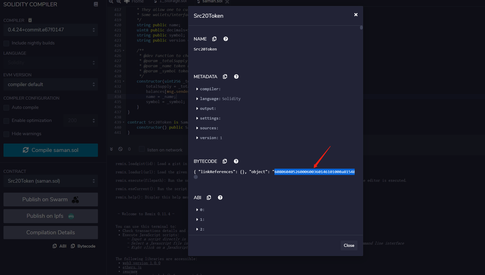

# Issue your token on Saman Chain

English | [简体中文](https://github.com/saman-org/issue-token/blob/master/README_ZH.md)

## Before issuing a token, you need to prepare the following:
1.Prepare an address that holds native Saman tokens (sufficient power)
2.Information about token issuance (abbreviated full name, total issuance, decimal places)

## Specific example steps

**Note:** The contract version needs to be <= 0.4.24

### 1.Modify the information in the example of [token contract](https://github.com/saman-org/issue-token/token.sol)

```go
contract SamanERC20Token is PausableToken {

    function () public {
      //if ether is sent to this address, send it back.
        revert();
    }

    string public name;
    uint8 public decimals=18;
    string public symbol;
    string public version = '1.0.0';

    constructor(uint256 _totalSupply, string _name, string _symbol) public {
        totalSupply = _totalSupply * 10 ** uint256(decimals);
        balances[msg.sender] = totalSupply;    // Give the creator all initial tokens
        name = _name;
        symbol = _symbol;
    }
}

contract Erc20Token is SamanERC20Token {
    constructor() public SamanERC20Token(10000, "ASD", "ASD") {}
}
```
E.g:
* ```decimals=18``` => ```decimals=8``` Decimal place changed from default 18 to 8
* ```SamanERC20Token(10000, "ASD", "ASD") {}``` The parameters in brackets are ```total amount of release```, ``full name'', ```shorthand``

### 2.Copy the modified contract and go to [Ethereum Remix](https://remix.ethereum.org/#optimize=false&evmVersion=soljson-v0.4.24+commit.e67f0147.js) to compile the contract and copy the compiled bytecode
* Step 1: Compile


* Step 2: Select the byte code of the specified constructor


* Step 3: Copy the corresponding bytecode



### 3.Deploy the contract in [MySamanWallet](https://wallet.samanchain.com)

* Step 1: Enter the deployment contract page


* Step 2: Paste bytecode and account private key


* Step 3: Deploy signed transactions


### 4.Successfully issued

Check on Chain Explorer