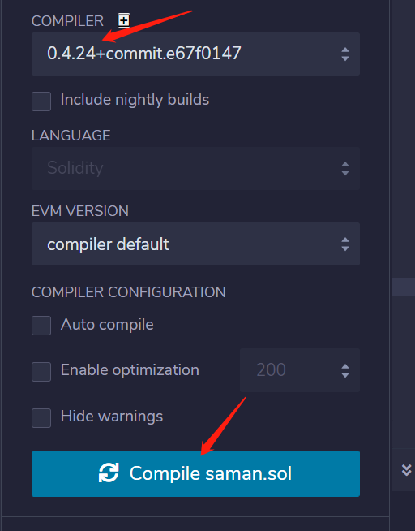

# 在Saman Chain上发行你的token

简体中文 | [English](https://github.com/saman-org/issue-token/README.md)

## 在发行token之前，你需要准备如下:
1.准备一个持有原生Saman代币的地址（充足的Power）  
2.token发行相关信息（简写 全称 总发行量 小数位）

## 具体示例步骤

**注意：** 合约版本需要在 <= 0.4.24

### 1.修改[token合约](https://github.com/saman-org/issue-token/token.sol)示例中的信息

```go
contract SamanERC20Token is PausableToken {

    function () public {
      //if ether is sent to this address, send it back.
        revert();
    }

    string public name;
    uint8 public decimals=18;
    string public symbol;
    string public version = '1.0.0';

    constructor(uint256 _totalSupply, string _name, string _symbol) public {
        totalSupply = _totalSupply * 10 ** uint256(decimals);
        balances[msg.sender] = totalSupply;    // Give the creator all initial tokens
        name = _name;
        symbol = _symbol;
    }
}

contract Erc20Token is SamanERC20Token {
    constructor() public SamanERC20Token(10000, "ASD", "ASD") {}
}
```
例如：
* ```decimals=18``` => ```decimals=8``` 小数位由默认的18维改成8位
* ```SamanERC20Token(10000, "ASD", "ASD") {}``` 括号内参数依次为```发行总量```、```全称```、```简写```

### 2.复制修改好的合约前往 [Ethereum Remix](https://remix.ethereum.org/#optimize=false&evmVersion=soljson-v0.4.24+commit.e67f0147.js) 编译合约，并复制编译所得字节码

* 第一步：编译



* 第二步：选择指定构造函数的字节码


* 第三步：复制对应的字节码


### 3.在[MySamanWallet](https://wallet.samandefi.com)中部署合约

* 第一步：进入部署合约页面


* 第二步：黏贴字节码和账号私钥


* 第三步：部署签名交易


### 4.发行成功

查看区块链浏览器